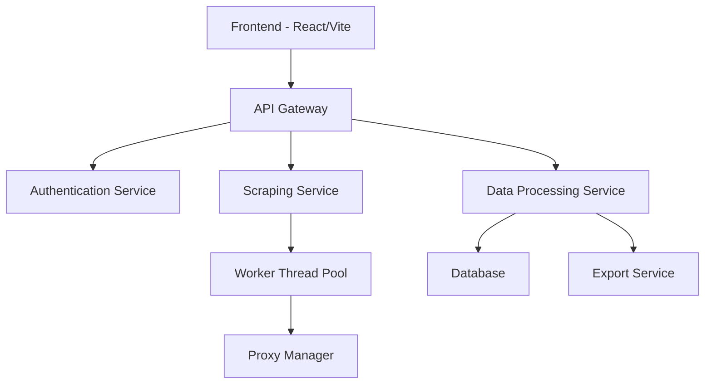

# LeadGenCopilot

A powerful lead generation platform with AI-powered features for business growth. Built with modern technologies and scalable architecture to handle high-volume data processing and concurrent scraping operations.

## 🚀 Features

### Current Features
- **Google Maps Business Scraper**
  - Advanced double-scroll technology for reliable data extraction
  - Concurrent processing with worker threads
  - Rate limiting and proxy rotation
  - Supports both sequential and parallel modes
  - Data validation and cleaning
  - Export to CSV/JSON formats
  - Real-time progress tracking
  - Error handling and retry mechanisms

### Upcoming Features
- **Email Finder & Verification** (In Development)
  - Pattern-based email discovery
  - SMTP verification
  - Domain validation
  - Bulk processing capabilities
  
- **Cold Outreach Engine** (Planned)
  - AI-powered message generation
  - A/B testing framework
  - Response rate analytics
  - Campaign management
  
- **WhatsApp Number Checker** (Planned)
  - Bulk verification system
  - Status checking
  - Profile data extraction
  - Rate limit handling
  
- **LinkedIn Auto Apply** (Planned)
  - Automated job application
  - Custom cover letter generation
  - Profile matching algorithms
  - Application tracking

## 🏗️ Architecture

### System Overview


### Components
1. **Frontend Layer**
   - React + Vite for fast development
   - TailwindCSS for styling
   - Framer Motion for animations
   - Real-time updates via WebSocket

2. **Backend Services**
   - Node.js + Express
   - Modular architecture
   - Microservices ready
   - Event-driven design

3. **Data Processing**
   - Worker thread pool for concurrent processing
   - Queue management system
   - Rate limiting and throttling
   - Data validation pipeline

4. **Storage Layer**
   - Scalable database design
   - Caching mechanisms
   - Export functionality
   - Data retention policies

## 🔌 API Endpoints

### Google Maps Scraper
```typescript
// Current Endpoints
POST /api/scrape-gmaps
{
  query: string,          // Search query
  maxResults?: number,    // Default: 10
  mode?: string,         // 'sequential' | 'parallel'
  options?: {
    useProxy?: boolean,
    retryCount?: number,
    timeout?: number
  }
}

// Response
{
  results: Array<{
    name: string,
    address: string,
    phone?: string,
    website?: string,
    rating?: number,
    reviewCount?: number,
    category?: string
  }>,
  stats: {
    processed: number,
    successful: number,
    failed: number,
    timeElapsed: number
  }
}

// Future Endpoints (Planned)
POST /api/scrape-gmaps/batch    // Batch processing
GET /api/scrape-gmaps/status    // Job status
POST /api/scrape-gmaps/cancel   // Cancel operation
GET /api/scrape-gmaps/export    // Export results
```

### Health & Monitoring
```typescript
GET /health
GET /metrics
GET /status
```

## ⚡ Performance

### Concurrent Processing
- **Worker Thread Pool**: Maintains 5-10 worker threads for parallel processing
- **Queue Management**: Implements priority queue for task management
- **Memory Management**: Optimized for large datasets with streaming
- **Processing Speed**: ~1-2 seconds per business entry in sequential mode
- **Batch Processing**: Up to 100 businesses per minute in parallel mode

### Resource Usage
- Memory: 200-500MB average
- CPU: 40-60% during active scraping
- Network: 1-2MB per business entry

## 🛠️ Technical Stack

### Frontend
- React 18
- Vite 5
- TailwindCSS 3
- Framer Motion
- Lucide Icons
- TypeScript

### Backend
- Node.js 18+
- Express
- Puppeteer
- Worker Threads
- WebSocket

### Development
- ESLint
- Prettier
- Husky
- Jest
- Cypress

## 📦 Installation

### Prerequisites
- Node.js >= 18.0.0
- npm >= 9.0.0
- Git

### Development Setup
1. Clone the repository:
```bash
git clone git@github.com:Cardano-max/LeadGenCopilot_v2.git
cd LeadGenCopilot_v2
```

2. Install frontend dependencies:
```bash
cd leadgen-copilot
npm install
```

3. Install backend dependencies:
```bash
cd backend
npm install
```

4. Set up environment variables:
```bash
# Frontend (.env)
VITE_API_URL=http://localhost:8080
VITE_WS_URL=ws://localhost:8080

# Backend (.env)
PORT=8080
NODE_ENV=development
PROXY_API_KEY=your_proxy_api_key
MAX_CONCURRENT_SCRAPES=5
```

### Running the Application

1. Start the backend server:
```bash
cd backend
npm run dev
```

2. Start the frontend development server:
```bash
cd leadgen-copilot
npm run dev
```

## 🔧 Configuration

### Scraper Configuration
```javascript
{
  maxConcurrentScrapes: 5,
  retryAttempts: 3,
  timeout: 30000,
  proxyEnabled: true,
  userAgentRotation: true,
  rateLimit: {
    windowMs: 60000,
    maxRequests: 100
  }
}
```

### Worker Thread Pool
```javascript
{
  minThreads: 5,
  maxThreads: 10,
  idleTimeout: 60000,
  queueSize: 1000
}
```

## 🧪 Testing

### Unit Tests
```bash
npm run test
```

### Integration Tests
```bash
npm run test:integration
```

### E2E Tests
```bash
npm run test:e2e
```

## 📈 Monitoring & Logging

### Metrics
- Request/Response times
- Success/Error rates
- Worker thread utilization
- Memory usage
- Queue length

### Logging
- Request logging
- Error tracking
- Performance metrics
- Audit trails

## 🔐 Security

- Rate limiting
- Input validation
- XSS protection
- CORS configuration
- Proxy rotation
- User agent randomization

## 🚀 Deployment

### Production Setup
1. Build the application:
```bash
# Frontend
cd leadgen-copilot
npm run build

# Backend
cd backend
npm run build
```

2. Start production servers:
```bash
# Frontend (using serve)
npx serve -s dist

# Backend
npm run start:prod
```

### Docker Support (Coming Soon)
```bash
# Build images
docker-compose build

# Run services
docker-compose up -d
```

## 📝 Contributing

1. Fork the repository
2. Create your feature branch
3. Commit your changes
4. Push to the branch
5. Create a Pull Request

## 📄 License

MIT License - see the [LICENSE](LICENSE) file for details

## 🤝 Support

For support, email support@leadgencopilot.com or join our Slack channel.

## 🗺️ Roadmap

### Q2 2024
- [ ] Email finder integration
- [ ] Improved proxy management
- [ ] Rate limiting optimization
- [ ] Docker support

### Q3 2024
- [ ] WhatsApp checker
- [ ] Cold outreach engine
- [ ] API documentation
- [ ] Performance improvements

### Q4 2024
- [ ] LinkedIn integration
- [ ] Enterprise features
- [ ] Analytics dashboard
- [ ] Multi-user support 